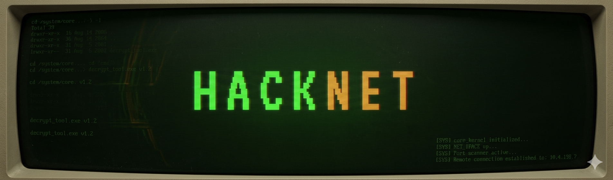

# 🕵️ HACKNET v2.4.1 — Terminal Hacking Simulator




<p align="center">
  
  
  
  
</p>

---

## Overview
HACKNET v2.4.1 is a **terminal-based hacking simulator** that immerses you in a **realistic cybersecurity challenge**. Play as a **hacker** accepting contracts, exploiting vulnerabilities, escalating privileges, and exfiltrating data—all while avoiding detection. The game features **4 unique contracts**, **9 unlockable tools**, and a **dynamic difficulty system** that adapts to your skill level.


---

## ✨ Key Features

### 🎮 **Core Gameplay Loop**

```
┌─────────────────────────────────────────────────────────┐
│  ACCEPT CONTRACT → CONNECT TO TARGET → RECON → EXPLOIT  │
│      → ESCALATE → EXFILTRATE → COVER TRACKS → SUBMIT    │
└─────────────────────────────────────────────────────────┘
```

### 📋 **4 Unique Contracts** with escalating difficulty

| Contract                                  | Difficulty    | Target            | Reward   | Rep | Objectives                                   |
| ----------------------------------------- | ------------- | ----------------- | -------- | --- | -------------------------------------------- |
| **Acme Corp — Data Exfiltration**  | 🔴 HARD       | `192.168.45.23` | $15,000  | +20 | 5 (Scan, Exploit, Escalate, Download, Cover) |
| **Stolen Laptop — Photo Recovery** | 🟢 EASY       | `127.0.0.1`     | $2,500   | +8  | 3 (Bypass, Locate, Recover)                  |
| **NexGen Bank — Wire Fraud**       | 🔴 HARD       | `10.42.0.1`     | $50,000  | +35 | 5 (Scan, Exploit, Pivot, Transfer, Cover)    |
| **Operation Silent Night — NSA**   | 💀 IMPOSSIBLE | `10.0.0.1`      | $250,000 | +50 | 5 (Zero-day, Scan, Locate, Exfil, Cover All) |

### 🛠️ **9 Unlockable Hacking Tools**

| Tool            | Cost   | Function                          |
| --------------- | ------ | --------------------------------- |
| `nmap`        | FREE   | Port scanner, service enumeration |
| `hydra`       | $500   | Brute-force password cracker      |
| `john`        | $300   | Hash cracker                      |
| `wireshark`   | $400   | Packet sniffer                    |
| `sqlmap`      | $1,000 | SQL injection automation          |
| `burpsuite`   | $800   | Web proxy & intercept             |
| `metasploit`  | $2,000 | Exploit framework                 |
| `proxychains` | $1,200 | Hide your IP, reduce trace        |
| `aircrack`    | $1,500 | WiFi cracking                     |

### 🔧 **25+ Realistic Commands**

| Category               | Commands                                                                             |
| ---------------------- | ------------------------------------------------------------------------------------ |
| **General**      | `help`, `contracts`, `accept`, `status`, `shop`, `buy`, `clear`        |
| **Network**      | `connect`, `disconnect`, `ping`, `ifconfig`, `traceroute`, `proxychains` |
| **Recon**        | `nmap`, `scan`, `searchsploit`                                                 |
| **Exploitation** | `exploit`, `hydra`, `sqlmap`, `sudo su -`                                    |
| **Post-Exploit** | `ls`, `cat`, `cd`, `pwd`, `download`, `wget`, `mysql`                  |
| **Evasion**      | `cover_tracks`, `clear_logs`, `proxy`                                          |
| **System**       | `whoami`, `uname`, `ps`, `history`, `submit`                               |

### 📊 **Dynamic Game Systems**

#### **Trace Level** 📈

- Increases with every action (scanning, exploiting, downloading)
- Visual feedback with color-coded progress bar
  - 🟢 **0-39%**: Safe
  - 🟡 **40-59%**: Elevated (warning)
  - 🟠 **60-79%**: High risk (alert)
  - 🔴 **80-99%**: Critical (toast warning)
  - 💀 **100%**: Traced — connection burned, reputation loss
- Reduce trace with `proxychains` or disconnecting

#### **Reputation System** 🏆

- 5 tiers based on reputation score (0-100)
  - `Script Kiddie` (0-20) — 🟢 Green
  - `Hacker` (21-40) — 🔵 Cyan
  - `Elite` (41-60) — 🟡 Yellow
  - `1337` (61-80) — 🔴 Red
  - `Anonymous` (81-100) — 🟣 Purple
- Unlocks higher-difficulty contracts
- Affects contract availability and rewards

#### **Credits Economy** 💰

- Earn credits from completed contracts
- Spend credits on tools in darknet shop
- Partial completion rewards based on objectives done

#### **Objective System** ✅

- Each contract has 3-5 specific objectives
- Track progress in right panel
- Real-time updates when objectives complete
- Contract submission rewards based on completion percentage

### 🖥️ **Authentic Terminal Experience**

- **Custom CRT effects** with scanlines and vignette
- **Matrix-style green** (`#39ff14`) primary color
- **Realistic progress bars** with percentage animation
- **Typing delays** for commands and outputs
- **ASCII art boot sequence** with HACKNET logo
- **Command history** with arrow key navigation
- **Ctrl+K shortcut** to focus terminal

### 🎨 **Cyberpunk Interface Design**

```
┌─────────────────────────────────────────────────────────┐
│  HACKNET v2.4.1         darknet [enc]  anonymous  ████  │
├─────────────────────────────────────────────────────────┤
│  ┌────────────┐  ┌────────────────────┐  ┌────────────┐ │
│  │ DARKNET    │  │ TERMINAL           │  │ STATUS     │ │
│  │ BOARD      │  │ $ nmap -sV         │  │ Trace: 23% │ │
│  │ [1] HARD   │  │ PORT  SERVICE      │  │ Objectives │ │
│  │ [2] EASY   │  │ 22    ssh          │  │ ✓ Scan     │ │
│  │ [3] HARD   │  │ 80    http         │  │ ○ Exploit  │ │
│  │ [4] ▲ LOCK │  │ 3306  mysql        │  │ ○ Escalate │ │
│  └────────────┘  └────────────────────┘  └────────────┘ │
└─────────────────────────────────────────────────────────┘
```

---

## 🚀 Quick Start Guide

### **Step 1: Browse Contracts**

```
hacknet@darknet:~$ contracts
```

View available jobs with difficulty, reward, and reputation requirements.

### **Step 2: Accept a Contract**

```
hacknet@darknet:~$ accept 1
```

Accept your first contract (Acme Corp). Note the target IP.

### **Step 3: Connect to Target**

```
hacknet@darknet:~$ connect 192.168.45.23
```

Establish an encrypted tunnel to the target.

### **Step 4: Reconnaissance**

```
hacknet@darknet:~$ nmap -sV
```

Scan for open ports and services. Identify vulnerabilities.

### **Step 5: Exploit**

```
hacknet@darknet:~$ searchsploit apache 2.4.41
hacknet@darknet:~$ exploit CVE-2021-41773
```

Find and run an exploit to gain initial access.

### **Step 6: Explore & Escalate**

```
hacknet@acme.corp:~$ ls
hacknet@acme.corp:~$ cat config.php
hacknet@acme.corp:~$ sudo su -
```

Navigate the filesystem, find credentials, escalate to root.

### **Step 7: Exfiltrate**

```
hacknet@acme.corp:~$ download Q4_Product_Roadmap.pdf
```

Download target files. Monitor trace level increases.

### **Step 8: Cover Tracks**

```
hacknet@acme.corp:~$ cover_tracks
```

Overwrite logs and clear history to avoid detection.

### **Step 9: Submit Contract**

```
hacknet@darknet:~$ submit
```

Return to darknet, submit completed objectives, collect reward.

---

## 🎯 **Game Mechanics Deep Dive**

### **Trace System**

Every action increases your trace level:

- `nmap`: +5%
- `exploit`: +8%
- `sudo`: +10%
- `download`: +12%
- `mysql`: +8%
- Failed commands: +2-3%

**Trace Reduction Methods:**

- `proxychains`: -25% (requires tool purchase)
- Disconnecting: -1% every 3 seconds when offline
- `cover_tracks`: -20% (after logs cleared)

### **Objective Completion Triggers**

| Contract      | Objective    | Trigger                             |
| ------------- | ------------ | ----------------------------------- |
| Acme Corp     | `scan`     | Run `nmap -sV`                    |
| Acme Corp     | `exploit`  | Successful exploit (CVE-2021-41773) |
| Acme Corp     | `escalate` | `sudo su -` success               |
| Acme Corp     | `download` | Download Q4_Product_Roadmap.pdf     |
| Acme Corp     | `cover`    | Run `cover_tracks`                |
| Stolen Laptop | `bypass`   | Successful exploit (MS17-010)       |
| Stolen Laptop | `locate`   | Download any Cancun photo           |
| Stolen Laptop | `recover`  | Download deleted_photos_backup.zip  |
| NexGen Bank   | `scan`     | Run `nmap -sV`                    |
| NexGen Bank   | `exploit`  | `sqlmap` success                  |
| NexGen Bank   | `pivot`    | `sudo su -` success               |
| NexGen Bank   | `transfer` | Download transfer_queue.sql         |
| NexGen Bank   | `cover`    | Run `cover_tracks`                |
| NSA Op        | `zeroday`  | Successful exploit                  |
| NSA Op        | `locate`   | Download Project_Stargate.enc       |
| NSA Op        | `exfil`    | Download via proxies                |
| NSA Op        | `coverall` | Run `cover_tracks`                |

### **File System Structure**

Each target has a realistic filesystem:

- `/` — Root directory
- `/root` — Root home (requires root access)
- `/var/log` — System logs
- `/etc` — Configuration files
- `/home` — User directories
- Custom contract-specific directories

### **Realistic Service Emulation**

Targets run actual services with versions:

- Apache 2.4.41 (vulnerable to CVE-2021-41773)
- OpenSSH 7.9
- MySQL 8.0.28
- SMB (Windows 10)
- nginx 1.18
- Tomcat 9.0
- SWIFT GPI 2.0

---

## 🎨 **Design & Aesthetics**

### **Terminal Authenticity**

- **Fonts**: `Share Tech Mono` and `VT323` for pixel-perfect terminal feel
- **Colors**: Matrix green (`#39ff14`) primary, with yellow warnings, red errors
- **CRT Effects**: Scanlines, vignette, phosphor glow
- **Animations**: Progress bars, blinking LEDs, scan line sweeps
- **Cursor**: Custom circular cursor with dot (mouse-follow)

### **Color Coding**

| Element      | Color     | Hex         | Purpose          |
| ------------ | --------- | ----------- | ---------------- |
| Primary Text | Green     | `#39ff14` | Standard output  |
| System       | Green Dim | `#1a7a09` | System messages  |
| Warning      | Yellow    | `#f5a623` | Warnings, alerts |
| Error        | Red       | `#ff3b30` | Errors, critical |
| Info         | Blue      | `#00aaff` | Information      |
| Success      | Cyan      | `#00ffcc` | Success messages |
| Gray         | Gray      | `#4a4a4a` | Metadata, hints  |

### **UI Panels**

| Panel                   | Content                | Features                                    |
| ----------------------- | ---------------------- | ------------------------------------------- |
| **Darknet Board** | Available contracts    | Difficulty badges, reward, lock status      |
| **Terminal**      | Main command interface | Scrollable output, input line, prompt       |
| **Status Panel**  | Player stats           | Trace bar, objectives, network nodes, tools |

---

## 🛠️ **Technical Implementation**

### **Architecture**

```
┌─────────────────────────────────────┐
│          HACKNET Game Engine         │
├─────────────────────────────────────┤
│                                     │
│  ┌─────────────────────────────┐   │
│  │      Game State (STATE)      │   │
│  │  • credits                   │   │
│  │  • reputation                 │   │
│  │  • trace                      │   │
│  │  • connected                  │   │
│  │  • activeContract             │   │
│  │  • objectives                 │   │
│  │  • tools                      │   │
│  └─────────────────────────────┘   │
│                                     │
│  ┌─────────────────────────────┐   │
│  │      Data Layer             │   │
│  │  • CONTRACTS (4)            │   │
│  │  • TOOLS_SHOP (9)           │   │
│  │  • REP_TIERS (5)            │   │
│  └─────────────────────────────┘   │
│                                     │
│  ┌─────────────────────────────┐   │
│  │      Command Parser         │   │
│  │  • 25+ commands             │   │
│  │  • argument validation      │   │
│  │  • async operations         │   │
│  └─────────────────────────────┘   │
│                                     │
│  ┌─────────────────────────────┐   │
│  │      UI Renderer            │   │
│  │  • terminal output          │   │
│  │  • contract list            │   │
│  │  • objectives               │   │
│  │  • trace bar                │   │
│  │  • toast notifications      │   │
│  │  • modal dialogs            │   │
│  └─────────────────────────────┘   │
└─────────────────────────────────────┘
```

### **Key Functions**

```javascript
// Core game loop
processCommand(cmd)          // Parse and execute user commands
addTrace(amount)             // Increase trace level, check thresholds
completeObjective(id)        // Mark objective as complete
updateTrace()                // Update trace bar visualization
triggerTraced()              // Handle 100% trace (game over event)

// Contract system
cmdAccept(args)              // Accept contract by ID
cmdConnect(args)             // Connect to target
cmdDisconnect()              // Drop connection
cmdSubmit()                  // Submit completed contract

// Recon commands
cmdNmap()                    // Port scan with service enumeration
cmdSearchsploit()            // Search exploit database

// Exploitation
cmdExploit()                  // Run specific CVE exploit
cmdHydra()                    // Brute-force attack
cmdSqlmap()                   // SQL injection
cmdSudo()                     // Privilege escalation

// Post-exploitation
cmdLs()                       // List files
cmdCat()                      // Read files
cmdCd()                       // Change directory
cmdDownload()                  // Exfiltrate files
cmdMysql()                    // Database access

// Evasion
cmdCoverTracks()              // Clear logs, reduce trace
cmdProxy()                    // Route through proxies

// UI helpers
showToast()                   // Notification system
showModal()                   // Modal dialog system
printProgress()                // Animated progress bar
```

### **Data Structures**

```javascript
// Contract object
{
  id: 'c1',
  title: 'Acme Corp — Data Exfiltration',
  diff: 'hard',
  diffLabel: 'HARD',
  reward: 15000,
  repReward: 20,
  targetIp: '192.168.45.23',
  services: [
    { port: 80, service: 'http', version: 'Apache 2.4.41' }
  ],
  vulns: ['CVE-2021-41773'],
  files: {
    '~': ['index.html', 'config.php'],
    '/root': ['Q4_Product_Roadmap.pdf']
  },
  fileContents: {
    'config.php': ['$db_pass = "root";']
  },
  objectives: [
    { id: 'scan', text: 'Scan open ports' }
  ]
}

// Tool object
{
  id: 'nmap',
  name: 'nmap',
  cost: 0,
  desc: 'Port scanner'
}
```

---

## 📊 **Game Statistics**

| Metric                          | Value |
| ------------------------------- | ----- |
| **Total Contracts**       | 4     |
| **Total Objectives**      | 18    |
| **Unlockable Tools**      | 9     |
| **Commands**              | 25+   |
| **Reputation Tiers**      | 5     |
| **Services Simulated**    | 8     |
| **CVEs Referenced**       | 4     |
| **File System Locations** | 10+   |
| **Realistic Files**       | 20+   |

---

## 🌐 **Browser Compatibility**

| Browser       | Support                                            |
| ------------- | -------------------------------------------------- |
| Chrome        | ✅ Full support                                    |
| Firefox       | ✅ Full support                                    |
| Safari        | ✅ Full support                                    |
| Edge          | ✅ Full support                                    |
| Opera         | ✅ Full support                                    |
| Mobile Chrome | ⚠️ Limited (terminal experience best on desktop) |
| Mobile Safari | ⚠️ Limited (terminal experience best on desktop) |

---

## 🚦 **Performance**

- **Load Time**: < 1.2 seconds (zero external dependencies)
- **Memory Usage**: < 35 MB
- **CPU Usage**: Minimal (event-driven)
- **Network**: Zero requests after initial load

---

## 🛡️ **Security Notes**

HACKNET is a **completely safe** educational game:

- ✅ No actual hacking or network connections
- ✅ All simulations run in browser memory
- ✅ No data collection or tracking
- ✅ No external dependencies
- ✅ Pure HTML/CSS/JavaScript
- ✅ Educational purposes only — learn ethical hacking methodology

---

## 📝 **License**

MIT License — see LICENSE file for details.

---

## 🙏 **Acknowledgments**

- **Hack The Box** — Inspiration for CTF-style challenges
- **TryHackMe** — Educational penetration testing methodology
- **Kali Linux** — Toolset inspiration
- **MITRE ATT&CK** — Exploit and vulnerability framework
- **OWASP** — Web application security concepts
- **Cyberpunk 2077** — Terminal aesthetic inspiration

---

## 📧 **Contact**

- **GitHub Issues**: [Create an issue](https://github.com/Willie-Conway/HACKNET/issues)
- **Website**: https://willie-conway.github.io/HACKNET/

---

## 🏁 **Future Enhancements**

- [ ] Add more contracts (5-10 total)
- [ ] Multiplayer leaderboard
- [ ] Custom contract builder
- [ ] Advanced firewall evasion minigames
- [ ] Real-time network traffic visualization
- [ ] SSH key-based authentication puzzles
- [ ] Buffer overflow exploitation minigame
- [ ] Achievement system
- [ ] Dark mode / light mode toggle
- [ ] Sound effects (optional)

---

<p align="center">
  <strong>🕵️ HACKNET v2.4.1 — Become the Ultimate Darknet Operative 🕵️</strong>
</p>


---

*Last updated: March 2026*
